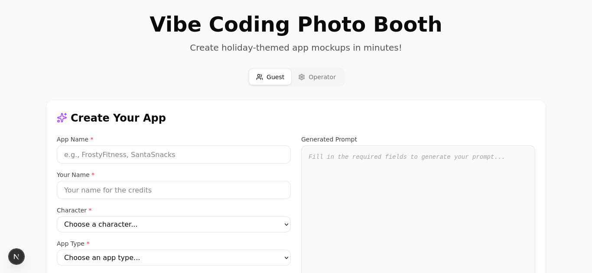

# Vibe Coding Photo Booth

A holiday tech meetup activity where guests create whimsical mobile app mockups in 2-3 minutes using AI-assisted coding. The system generates themed app screens that get captured and assembled into shareable photo collages.



## Features

- **17 Holiday Character Themes** - Santa, Mrs. Claus, Rudolph, Frosty, Nutcracker, and more
- **12 App Type Templates** - Ride-share, food delivery, dating, fitness, productivity, etc.
- **Live Collage Preview** - See your app screens rendered in beautiful phone mockups
- **3 Collage Layouts** - Choose from cascading cards, tilted hero, or stacked showcase
- **AI-Powered App Generation** - Use Claude Code to generate complete app mockups from prompts


## Getting Started

### Prerequisites

- Node.js 18+
- npm or yarn

### Installation

1. Clone the repository:
   ```bash
   git clone https://github.com/your-org/2025-a4d-ai-photo-booth.git
   cd 2025-a4d-ai-photo-booth
   ```

2. Install dependencies:
   ```bash
   npm install
   ```

3. Start the development server:
   ```bash
   npm run dev
   ```

4. Open [http://localhost:3000](http://localhost:3000) in your browser.

## How to Use

### For Guests (Creating an App)

1. **Fill out the form** on the homepage:
   - Enter your **App Name** (e.g., "FrostyFitness")
   - Enter **Your Name** for credits
   - Select a **Character** theme (determines color palette)
   - Select an **App Type** (determines UI patterns)

2. **Copy the generated prompt** and give it to the operator running Claude Code

3. **View your app** once generated at `/app{N}` (e.g., `/app5`)

4. **Create your collage** at `/collage/app{N}`:
   - Choose from 3 different layouts (A, B, C)
   - Click "Download Collage" to save your creation

### For Operators (Running Claude Code)

1. **Start Claude Code** with the project open

2. **Use the `/new-app` command** with guest details:
   ```
   /new-app Create "SleighShare" by Jamie using rudolph theme as a ride-share app
   ```

3. **Or paste the generated prompt** from the guest form into Claude Code

4. **Direct guests to the collage page** at `/collage/app{N}` to download their creation

## Available Themes

| Theme | Character | Holiday |
|-------|-----------|---------|
| `santa` | Santa Claus | Christmas |
| `mrs-claus` | Mrs. Claus | Christmas |
| `scrooge` | Scrooge | Christmas |
| `rudolph` | Rudolph | Christmas |
| `frosty` | Frosty | Christmas |
| `jack-frost` | Jack Frost | Christmas |
| `nutcracker` | The Nutcracker | Christmas |
| `sugar-plum` | Sugar Plum Fairy | Christmas |
| `krampus` | Krampus | Christmas |
| `father-time` | Father Time | Christmas |
| `baby-new-year` | Baby New Year | Christmas |
| `polar-bear` | Polar Bear Pete | Christmas |
| `maccabee` | Judah Maccabee | Hanukkah |
| `shamash` | The Shamash | Hanukkah |
| `umoja` | Umoja (Unity) | Kwanzaa |
| `kuumba` | Kuumba (Creativity) | Kwanzaa |
| `solstice` | Winter Solstice | Winter |

## App Types

| Type | UI Pattern |
|------|------------|
| `ride-share` | Map-centric with bottom sheet |
| `food-delivery` | Cards with horizontal scroll |
| `dating` | Card stack with swipe gestures |
| `finance` | Charts, numbers, indicators |
| `social` | Grid, stories, floating action |
| `fitness` | Progress rings, large numbers |
| `music` | Album art dominant, playback bar |
| `productivity` | Checkboxes, kanban hints |
| `weather` | Large icons, temperature dominant |
| `ecommerce` | Product cards, filters, CTAs |
| `wellness` | Calm colors, centered content |
| `recipe` | Hero image, structured lists |

## Collage Layouts


- **Layout A: Cascading Cards** - Stepped phones with subtle tilts, dark background
- **Layout B: Tilted Hero** - Hero phone with title text overlay, light background
- **Layout C: Stacked Showcase** - Overlapping tilted screens with fanned effect, dark background

## Project Structure

```
app/
├── page.tsx              # Homepage with prompt builder
├── app1/ - app11/        # Generated app slots
├── collage/[folder]/     # Collage preview & download
├── preview/[theme]/      # Theme color previews
└── api/                  # API routes
components/
├── booth/                # Photo booth UI components
└── ui/                   # Base UI components (shadcn)
lib/
├── registry.ts           # Character & app type data
├── collage-layouts.ts    # Layout configurations
└── collage-generator.ts  # Image generation
```

## Tech Stack

- **Framework**: Next.js 16 with App Router
- **Language**: TypeScript
- **Styling**: Tailwind CSS 4 with CSS variables for theming
- **UI Components**: Custom booth components + shadcn/ui
- **Image Processing**: Sharp (for collage generation)

## Development

### Available Scripts

```bash
npm run dev      # Start development server
npm run build    # Production build
npm run lint     # Run ESLint
```

### Adding a New Theme

1. Add CSS variables to `app/globals.css` under `[data-theme="new-theme"]`
2. Add entry to `CHARACTER_DATA` in `lib/registry.ts`
3. Theme preview auto-generates at `/preview/new-theme`

### Adding New App Slots

When apps 12+ are needed, add lazy imports to `components/booth/collage-preview-live.tsx`:

```typescript
12: {
  splash: lazy(() => import('@/app/app12/page').catch(() => ({ default: () => null }))),
  screen1: lazy(() => import('@/app/app12/screen-1/page').catch(() => ({ default: () => null }))),
  screen2: lazy(() => import('@/app/app12/screen-2/page').catch(() => ({ default: () => null }))),
},
```

## License

MIT

## Credits

Made with Claude Code for A4D Holiday Tech Meetup
